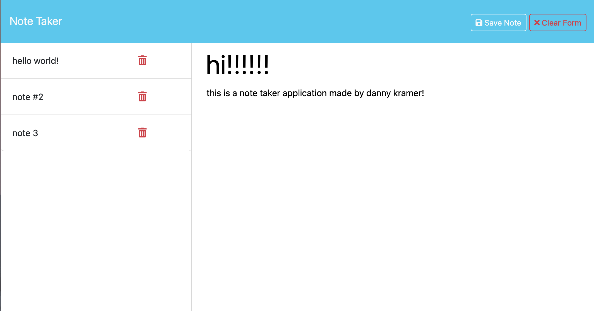

# Note Taker

## Description

Note Taker is a simple application that allows users to write, save, and delete notes. This application uses an Express.js back end to save and retrieve note data from a JSON file. The front end has been provided, and the back end was built to complete the application. The application is deployed on Render.

## Table of Contents

- [Installation](#installation)
- [Usage](#usage)
- [API Routes](#api-routes)
- [Screenshots](#screenshots)
- [Deployment](#deployment)
- [License](#license)
- [Questions](#questions)

## Installation

1. Clone the repository:
   ```sh
   git clone https://github.com/dannylkramer/note-taker-express.js.git
   ```

2. Navigate to the project directory:
   ```sh
   cd note-taker
   ```

3. Install the dependencies:
   ```sh
   npm install
   ```

4. Start the server:
   ```sh
   npm start
   ```

   The application will run on `http://localhost:3000`.

## Usage

1. Open the application in your browser by navigating to `http://localhost:3000`.
2. You will be presented with a landing page with a link to the notes page.
3. Click on the "Get Started" button to navigate to the notes page.
4. On the notes page, you can view existing notes in the left-hand column and create a new note using the fields in the right-hand column.
5. To create a new note, enter a note title and the note's text.
6. Click the "Save" button in the navigation bar to save the note.
7. The saved note will appear in the left-hand column with the other existing notes.
8. To view a note, click on it in the left-hand column.
9. To delete a note, click the delete icon next to the note in the left-hand column.

## API Routes

The following API routes are available:

- `GET /api/notes` - Returns all saved notes as JSON.
- `POST /api/notes` - Saves a new note and returns the new note as JSON.
- `DELETE /api/notes/:id` - Deletes the note with the specified ID.

## Screenshots




## Deployment

The application is deployed on Render. You can access it [here](https://note-taker-express-js-17j3.onrender.com).

## License

This project is licensed under the MIT License.

## Questions

If you have any questions about the repo, open an issue or contact me directly at [your-email@example.com](mailto:your-email@example.com). You can find more of my work at [your-github-username](https://github.com/your-github-username).
